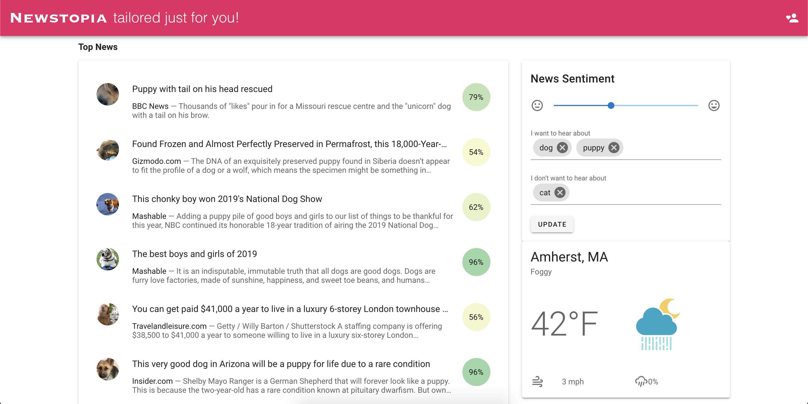

# CS 326 Group 12

## Team Members

- [Matt Rossman](team/matt-rossman.md)
- [Ayush Khandelwal](team/AyushKhandelwal.md) 
- [Alexandra Ferrucci](team/ali-ferrucci.md)
- [Wesley Tey](team/wtey.md)

## Overview

We are building a news app with a focus on users' mental health that allows more control over the type of content consumed.
Users will be able to filter out negative articles from various sources. They can also filter out certain topics that upset them. We are considering showing stats about the article's trustworthiness as well.
This makes readers less vulnerable to emotional-manipulation tactics, or simply lets them see the world in a more positive light.

## Topic Requirements

- Server-side: The article fetching, sentiment analysis, and filtering occurs on a Python backend
- Ajax: We make Ajax request through [axios](https://www.npmjs.com/package/axios) to our Python backend and the weather API




## Running

The frontend and backend can be run with Docker Compose.

#### API Keys

You must add a `config.yaml` in the `api` directory containing your API keys for News API and Indico.

Example:

```yaml
keys:
  indico: abc123
  newsapi: xyz789
```

Then start the api and website services with:

    docker-compose up

This will publish the API on port 5001 and the website on port 5000. Thus, you can access the site at http://localhost:5000